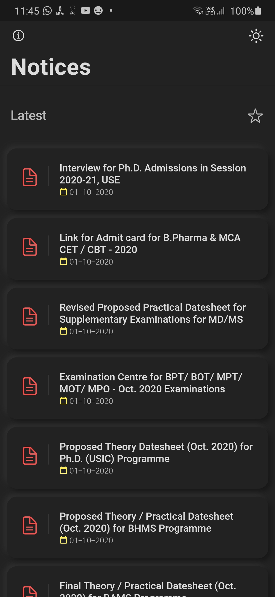
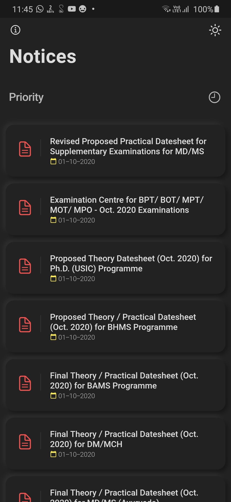
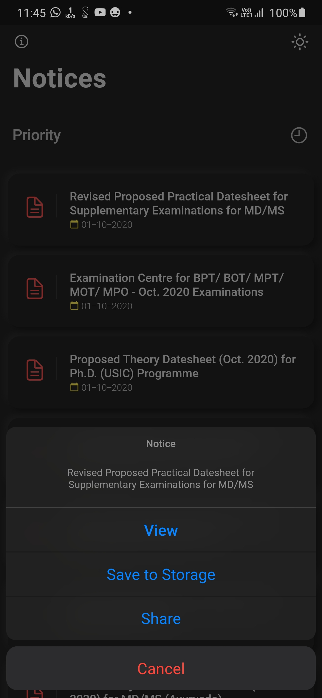
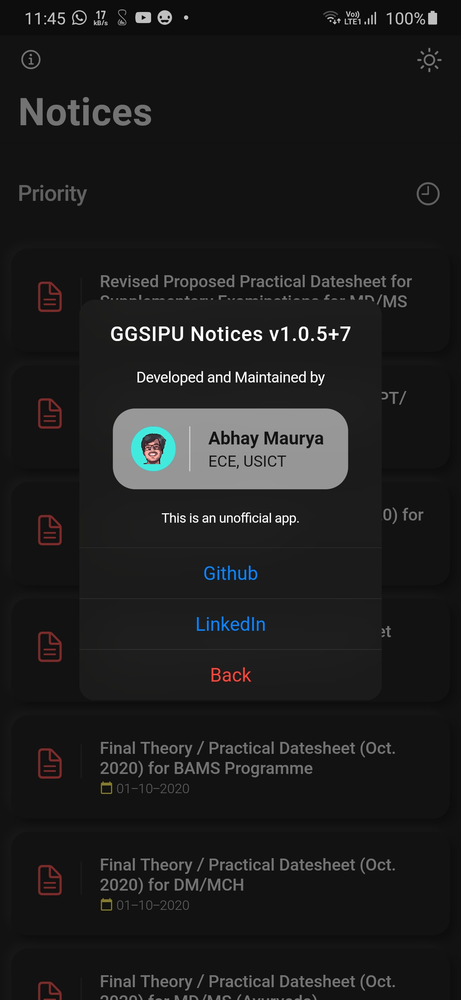
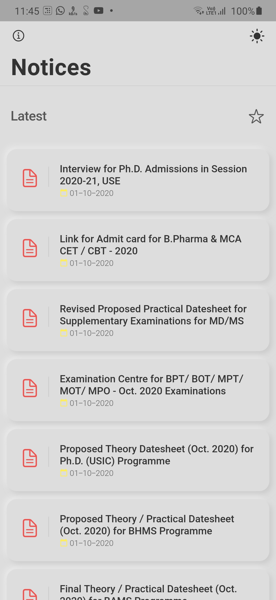
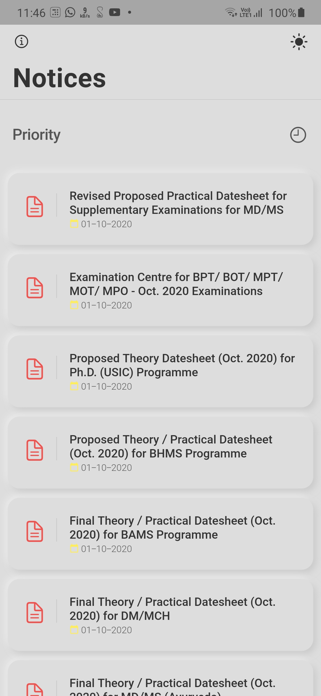
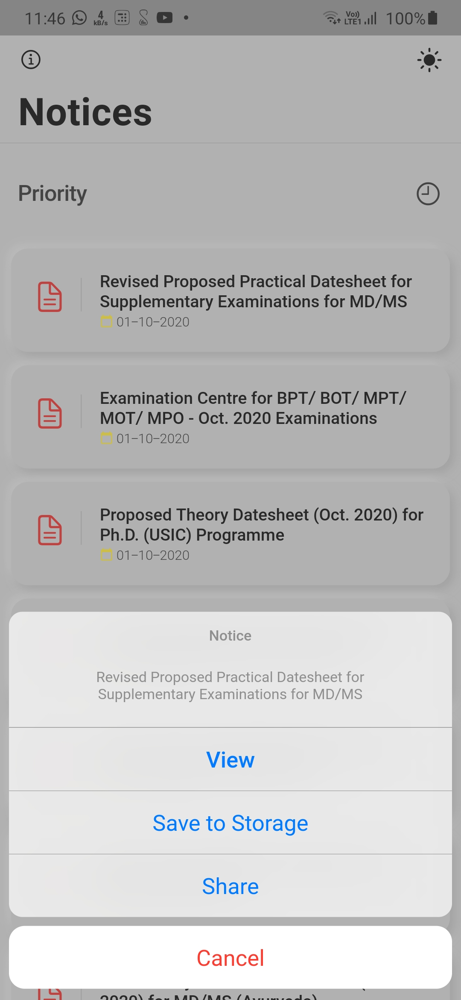
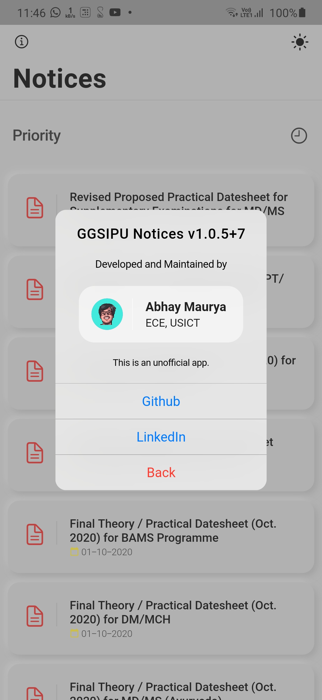

## Features

- Clean Neumorphic design
- Auto Dark Mode
- Instantly view or download notices in one tap
- Push Notifications for new notices
- Find notices by priority
- Fully optimised and smooth application
- Small application size (Under 6.5 MB)

## Demo

### Dark Theme

|  |  |  |  |
| :-------------: | :-------------: | :-------------: | :-------------: |
|   Latest        |    Priority     |  Notice Actions |      About      |

### Light Theme

|  |  |  |  |
| :-------------: | :-------------: | :-------------: | :-------------: |
|   Latest        |    Priority     |  Notice Actions |      About      |

## Dependencies

The following packages are needed for the development of this application.

- `flutter_neumorphic: ^1.0.7` for neumorphic design
- `firebase_database: 3.1.5` for notice database
- `firebase_messaging: ^6.0.13` for push notifications
- `url_launcher: ^5.4.5` for launching urls
- `cupertino_icons: ^1.0.0` for cupertino icons
- `share: ^0.6.5+2` for sharing links
- `flutter_downloader: ^1.5.1` for downloading pdfs
- `path_provider: ^1.6.18` for getting external storage
- `permission_handler: ^5.0.1+1` fot external storage permission
